# wanted-item-app

欲しい人が商品説明と買取希望金額を登録し、売り手を募集できる買い手先行型Webアプリ

## 概要
フリマサイトなどに出回りづらいニッチな商品や、生産終了により店舗で見つけにくくなった商品について、欲しい人が先に募集を出し、売ってくれる人からの連絡を受けられるアプリ

## 開発位置づけ
本アプリは個人学習・個人開発として制作しているポートフォリオである。

## 背景・目的
市場に出回りにくい商品を入手するために、継続的にフリマサイトやネットショップを確認する必要があり、その情報収集コストが購入金額以上に大きいと感じた。
フリマサイト等で見つけにくいニッチな商品や生産終了品について、欲しい人が買取希望金額を提示して募集を出せる仕組みを作ることで、継続的な市場調査の負担を減らすことを目的とする。

## 想定利用フロー
1. 買い手が欲しい商品を募集投稿する
2. 売り手が募集一覧や募集詳細を見て、売れる商品があれば連絡する
3. 売り手の連絡を買い手が確認し、条件が合えば記載された連絡先に連絡する
4. 買い手からの連絡・商品の受け渡し・支払いはアプリ外で行う

本アプリでは、売り手から買い手への初回連絡までをアプリ内機能の対象とし、その後の個別連絡や取引はアプリ外で行う想定とした。

## 実装済み機能
- 募集一覧表示
- 募集詳細表示
- 募集投稿
- 募集編集
- 募集削除
- ログイン
- アカウント登録
- 自分の募集一覧表示
- 売り手から買い手へのメッセージ送信
- アカウント編集 / 削除
- 入力値バリデーション
- PostgreSQLとの接続
- Spring Boot / MyBatis を用いたDB連携
- React から Java API を呼び出して画面表示・登録・更新する機能

## 今後の実装予定
- 受信メッセージ一覧表示
- 受信メッセージ詳細表示
- 画像アップロード機能
- JavaScriptをTypeScriptへ移行
- README の改善

## 画面一覧
- ログイン画面
- アカウント登録画面
- 募集一覧画面
- 募集詳細画面
- 募集投稿画面
- 自分の募集一覧画面
- メッセージ送信画面
- 受信メッセージ一覧画面
- 受信メッセージ詳細画面
- アカウント編集 / 削除画面

## 使用技術
### フロントエンド
- React
- JavaScript
- Vite

### バックエンド
- Java 21
- Spring Boot
- MyBatis
- Maven

### データベース
- PostgreSQL

### 開発環境・ツール
- Eclipse / Pleiades
- Visual Studio Code
- pgAdmin 4
- Git / GitHub

## 設計・構成
フロントエンドは React、バックエンドは Java / Spring Boot、データベースは PostgreSQL を使用した。  
募集一覧・募集詳細・募集投稿・募集編集について、React から Spring Boot の API を呼び出し、MyBatis 経由で PostgreSQL のデータを取得・更新する構成である。

バックエンドは以下の流れで処理を行う。

- Controller
- Service
- Mapper
- Mapper XML
- Database

## 画面遷移図

## ER図
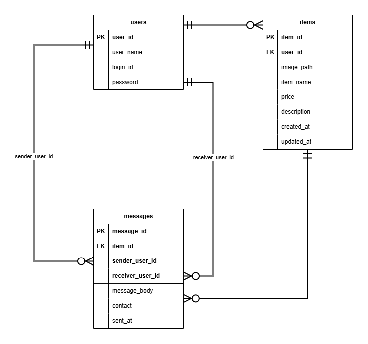

## DB定義
### users テーブル
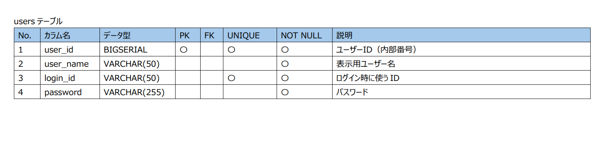

### items テーブル
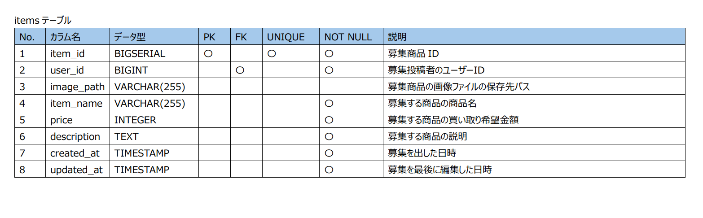

### messages テーブル
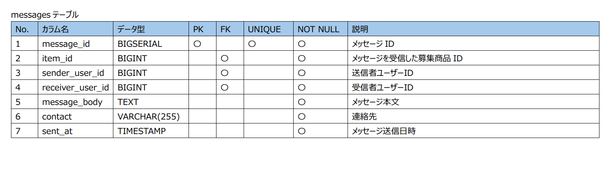

## シーケンス図
### ログイン機能
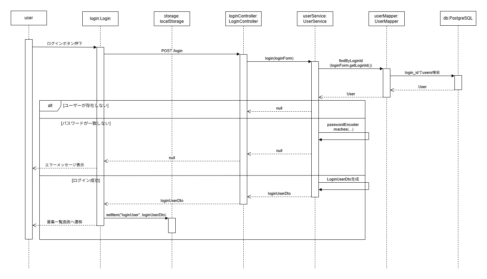

### アカウント登録機能
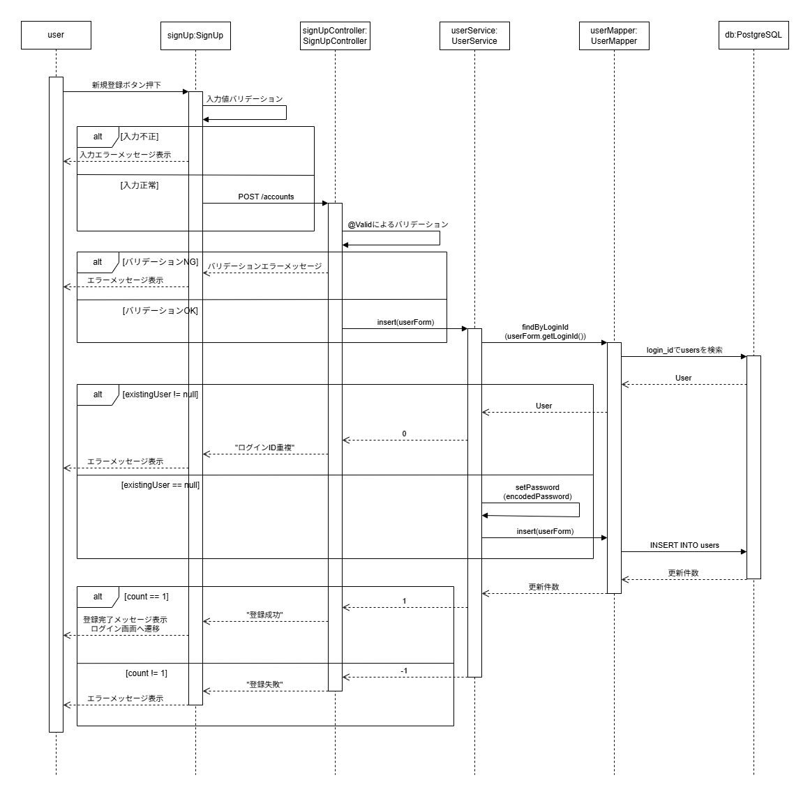

### 募集一覧機能
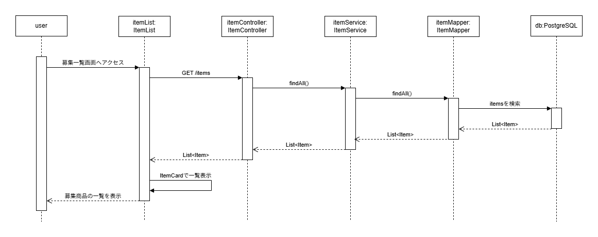

### 募集投稿機能
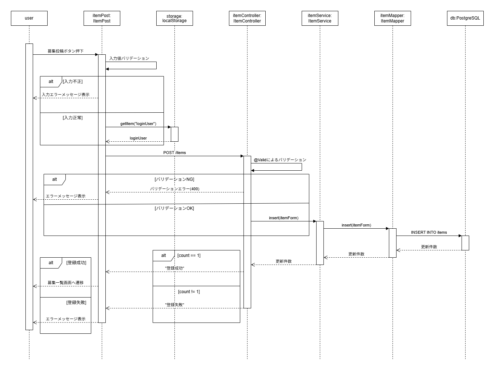

### 募集編集機能
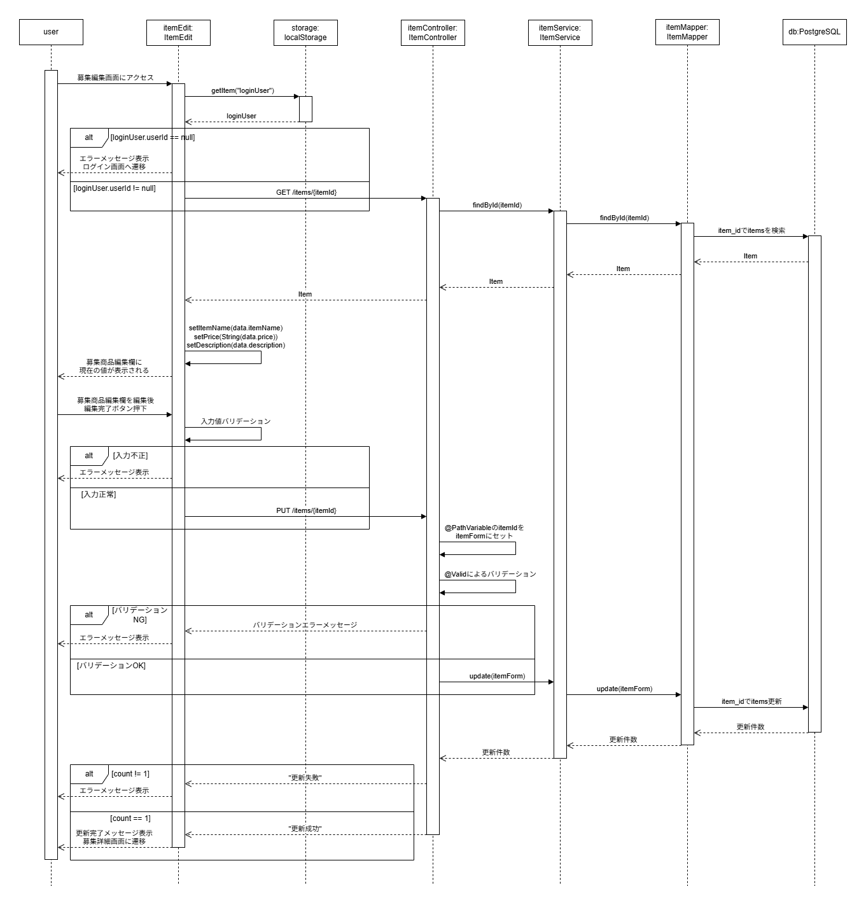

### アカウント編集機能
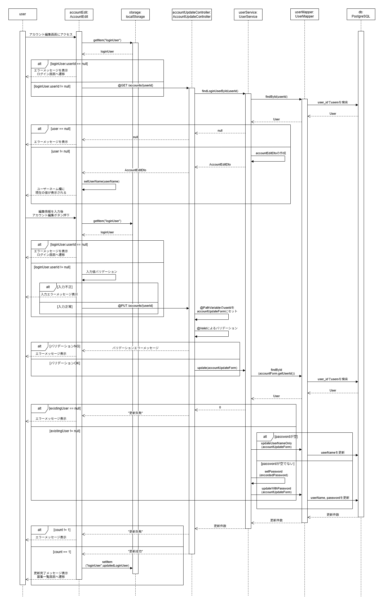

### アカウント削除機能
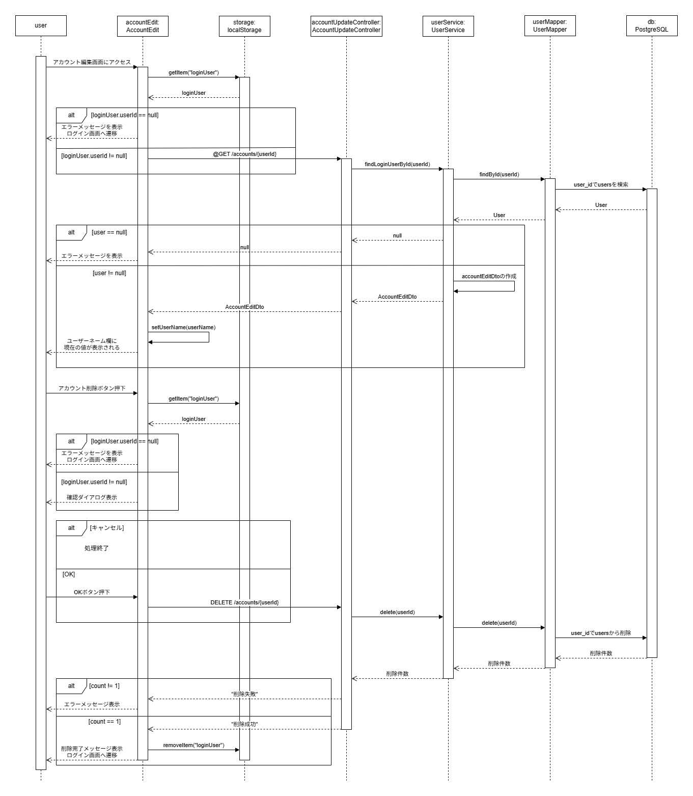

