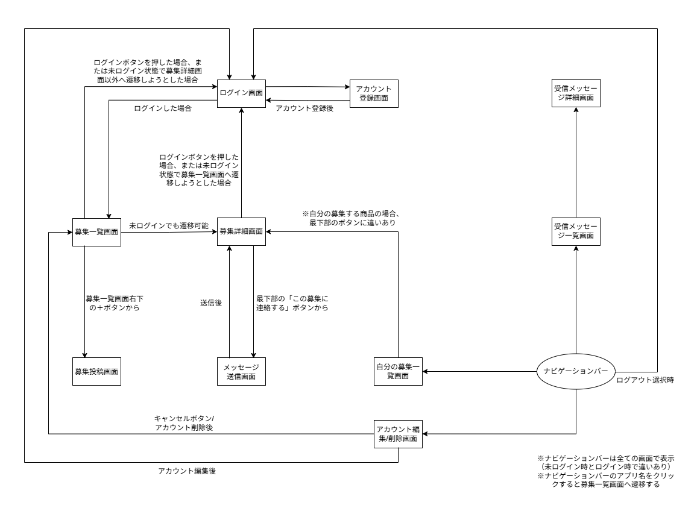

# wanted-item-app

欲しい人が商品説明と買取希望金額を登録し、売り手を募集できる買い手先行型Webアプリ

## 概要
フリマサイトなどに出回りづらいニッチな商品や、生産終了により店舗で見つけにくくなった商品について、欲しい人が先に募集を出し、売ってくれる人からの連絡を受けられる仕組みを想定したアプリ

## 背景・目的
市場に出回りにくい商品を入手するために、継続的にフリマサイトやネットショップを確認する必要があり、その情報収集コストが購入金額以上に大きいと感じた。
フリマサイト等で見つけにくいニッチな商品や生産終了品について、欲しい人が買取希望金額を提示して募集を出せる仕組みを作ることで、継続的な市場調査の負担を減らすことを目的とする。

## 主な機能（MVP）
- アカウント登録
- ログイン
- 募集一覧表示
- 募集詳細表示
- 募集投稿
- 自分の募集一覧表示
- 売り手から買い手へのメッセージ送信
- 受信メッセージ一覧表示
- アカウント編集 / 削除

## 画面一覧
- ログイン画面
- アカウント登録画面
- 募集一覧画面
- 募集詳細画面
- 募集投稿画面
- 自分の募集一覧画面
- メッセージ送信画面
- 受信メッセージ一覧画面
- 受信メッセージ詳細画面
- アカウント編集 / 削除画面

## 使用技術
- Java 21
- Spring Boot
- Maven
- Eclipse / Pleiades
- Git / GitHub

## 設計
本アプリは募集と問い合わせの導線を提供することを目的とし、商品の受け渡しや代金の支払いはアプリ外で行う想定。

画面遷移図を作成し、未ログイン状態でも募集一覧画面、募集詳細画面は閲覧できる構成とした。
未ログイン状態で、ログインが必要な募集投稿やメッセージ送信などの画面へ遷移しようとした場合はログイン画面へ遷移する設計とした。

## 画面遷移図

## 今後の実装予定
- シーケンス図作成
- ER図作成
- ログイン機能の実装
- 募集投稿機能の実装
- 一覧 / 詳細表示機能の実装
- メッセージ機能の実装
- README の改善